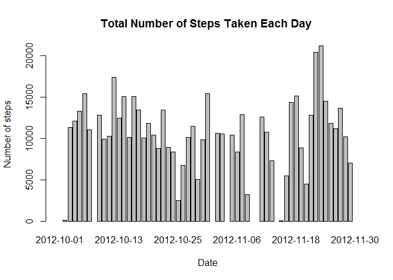
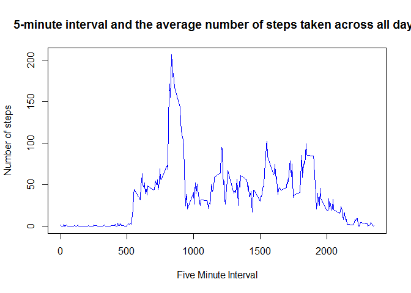
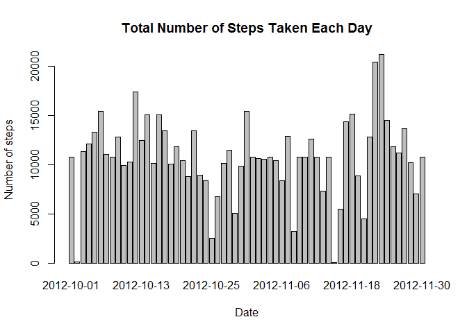
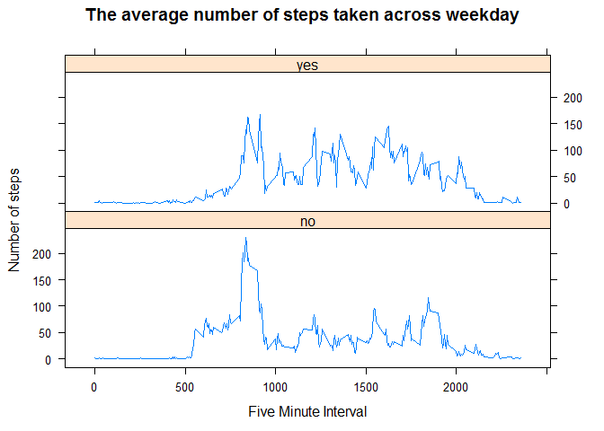

Reproducible Research : Peer Assessment 1
================

Include code
------------

### **Loading and preprocessing the data**

Show any code that is needed to
1. Load the data (i.e. read.csv()):

``` r
setwd("C:/statistics/reproducible_research/course_project_1")
unzip("repdata%2Fdata%2Factivity.zip")
activity <- read.csv("activity.csv")
```

2.Process/transform the data (if necessary) into a format suitable for your analysis

``` r
activity$steps <- as.numeric(as.character(activity$steps))
activity$interval <- as.numeric(as.character((activity$interval)))
activity$date1 <- as.Date(activity$date, "%Y-%m-%d")
str(activity)
```

    ## 'data.frame':    17568 obs. of  4 variables:
    ##  $ steps   : num  NA NA NA NA NA NA NA NA NA NA ...
    ##  $ date    : Factor w/ 61 levels "2012-10-01","2012-10-02",..: 1 1 1 1 1 1 1 1 1 1 ...
    ##  $ interval: num  0 5 10 15 20 25 30 35 40 45 ...
    ##  $ date1   : Date, format: "2012-10-01" "2012-10-01" ...

### **What is mean total number of steps taken per day?**

For this part of the assignment, you can ignore the missing values in the dataset
1. Calculate the total number of steps taken per day

``` r
step_per_day <- sum(activity$steps, na.rm =TRUE) / 61 
step_per_day
```

    ## [1] 9354.23

2.Make a histogram of the total number of steps taken each day

``` r
aggTotals <- aggregate(steps ~ date1, activity, sum, na.rm=FALSE,       na.action=NULL )
#Given there are missing values in 8 dates, we will included them in the aggTotals  
barplot(aggTotals$steps, names.arg=as.character(aggTotals$date1), xlab="Date", ylab="Number of steps", main="Total Number of Steps Taken Each Day ")
```



3.Calculate and report the mean and median of the total number of steps taken per day

``` r
 mean(aggTotals$steps, na.rm=TRUE) 
```

    ## [1] 10766.19

``` r
 median(aggTotals$steps, na.rm=TRUE )
```

    ## [1] 10765

### **What is the average daily activity pattern?**

1.  Make a time series plot(i.e. type="l") of the 5-minute interval (x-axis) and the average number of steps taken, averaged across all days (y-axis)

``` r
aggTotals2 <- aggregate(steps ~ interval, activity, FUN = mean, na.rm=TRUE)
 
library(plyr)
plot(aggTotals2$interval, aggTotals2$steps,type="l",col="blue",    xlab="Five Minute Interval", ylab="Number of steps",main="5-minute interval and the average number of steps taken across all days")
```



2.Which 5-minute interval, on average across all the days in the dataset, contains the maximum number of steps?

``` r
aggTotals2[aggTotals2$steps==max(aggTotals2$steps, na.rm = FALSE), ]
```

    ##     interval    steps
    ## 104      835 206.1698

### **Imputing missing values**

1.  Calculate and report the total number of missing values in the dataset(i.e. the total number of rows with NAs)

``` r
 mean(is.na(activity$date))
```

    ## [1] 0

``` r
 mean(is.na(activity$interval))
```

    ## [1] 0

``` r
 mean(is.na(activity$steps))
```

    ## [1] 0.1311475

``` r
 count(is.na(activity$steps))
```

    ##       x  freq
    ## 1 FALSE 15264
    ## 2  TRUE  2304

2304 missing values in the dataset.

2.Devise a strategy for filling in all of the missing values in the dataset. I will use the mean for that 5-minute interval
3.Create a new dataset that is equal to the original dataset but with the missing data filled in.

``` r
aggTotals2 <-setnames(aggTotals2, 2, "ave_steps")
total<- merge(activity,aggTotals2,by="interval") 
total$steps <- ifelse(is.na(total$steps), total$ave_steps, total$steps)
total <- subset(total, select=c(interval, steps, date1) )
```

4.Make a histogram of the total number of steps taken each day and calculateand report the **mean** and **median** total number of steps taken per day. Do these values differ from the estimates of the total daily number of steps taken per day. Do these values differ from the estimates from the first part of the assignment? What is the impact of imputing missing data on the estimates of the total daily number of steps?

``` r
 aggTotals3 <- aggregate(steps ~ date1, total, sum, na.rm=FALSE, na.action=NULL )
 barplot(aggTotals3$steps, names.arg=as.character(aggTotals3$date1), xlab="Date", ylab="Number of steps", main="Total Number of Steps Taken Each Day")
```



``` r
 mean(aggTotals3$steps) 
```

    ## [1] 10766.19

``` r
 median(aggTotals3$steps)
```

    ## [1] 10766.19

There is no difference of mean of steps between imputed data and the original data. A slightly different of median of steps was found between imputed data and the original data.

### **Are there differences in activity patterns between weekdays and weekends?**

For this part the weekdays() function may be of some help here. Use the dataset with the filled-in missing values for this part.
1. Create a new factor variable in the dataset with two levels -"weekday" and "weekend" indicating whether a given date is a weekday or weekend day.

``` r
 total$weekday <- weekdays(total$date1)
 total$weekend <- as.factor(ifelse(total$weekday %in% c("Saturday", "Sunday"), "yes", "no"))
 table(total$weekend)
```

    ## 
    ##    no   yes 
    ## 12960  4608

2.Make a panel plot containing a time series plot (i.e. type="l") of the 5-minute interval (x-axis) and the average number of steps taken, averaged across all weekday days or weekend days(y-axis).

``` r
 aggTotals4 <- aggregate(steps ~ weekend + interval, total, FUN = mean, na.rm=TRUE)
 
library(lattice)
xyplot(steps ~ interval | weekend, aggTotals4, type = "l", layout = c(1, 2), xlab = "Five Minute Interval", ylab = "Number of steps", main="The average number of steps taken across weekday")
```


